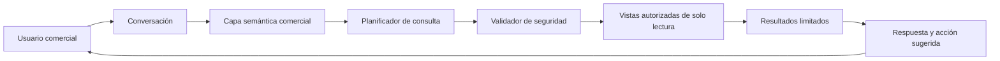

# Evolución del asistente comercial

## Decisión

La experiencia comercial se mantiene en lenguaje natural y orientada a decisiones. La implementación actual es determinista: responde un catálogo acotado de preguntas con el escenario, los proyectos seleccionados y el snapshot disponible. No ejecuta SQL, no consulta internet durante la conversación y no guarda el texto escrito por el usuario.

La evolución prevista es un agente de consulta de datos de solo lectura. El usuario no verá SQL ni nombres de tablas; preguntará por zona, precio, competencia, producto, movimientos y argumentos comerciales.

## Biblioteca comercial

Las preguntas se organizan por el trabajo que permiten realizar:

| Trabajo comercial | Preguntas representativas | Disponibilidad |
| --- | --- | --- |
| Leer mercado y precio | ¿Cómo se presenta la oferta comparable? ¿Cuántos proyectos tienen precio y área? | Actual |
| Revisar competencia | ¿Qué diferencias hay entre los proyectos elegidos? ¿Qué proyecto se diferencia más? | Actual, requiere selección |
| Detectar movimientos | ¿Qué proyectos cambiaron de precio? ¿Qué competidor conviene revisar primero? | Actual para cambios publicados cargados |
| Preparar un argumento | ¿Qué puedo afirmar? ¿Qué debo validar antes de presentar la lectura? | Actual |
| Monitorear oferta | ¿Qué unidades nuevas aparecieron? ¿Qué descuentos o promociones se publicaron? | Requiere actualización continua |
| Evaluar producto y financiamiento | ¿Qué tipologías concentran oferta? ¿Qué financiamiento ofrece cada proyecto? | Requiere ampliar y normalizar fuentes |
| Conectar desempeño de Viva | ¿Qué oferta compite con nuestro stock? ¿Qué argumento convierte mejor? | Requiere inventario, ventas y CRM internos |

Una pregunta que solicite precios de cierre, causas no publicadas, predicciones de demanda o datos personales debe rechazarse o reformularse. El precio publicado nunca se presenta como precio real de cierre.

## Arquitectura objetivo

La capa semántica traduce conceptos como “competidor similar”, “zona”, “precio publicado”, “unidad disponible” o “última revisión” a campos y reglas canónicas. El modelo propone una consulta; un validador independiente decide si puede ejecutarse.

## Controles obligatorios

- Conexión mediante un rol exclusivo de solo lectura.
- Acceso únicamente a vistas comerciales autorizadas, nunca a tablas operativas completas.
- Solo consultas `SELECT`; se rechazan escritura, definición de esquema, procedimientos y múltiples sentencias.
- Parámetros tipados para distrito, zona, fechas, rangos y proyectos.
- Límite de filas, tiempo máximo, costo y tamaño de respuesta.
- Aislamiento por organización y exclusión de información personal.
- Registro de pregunta, plan aprobado, versión de datos y resultado; el SQL queda fuera de la interfaz comercial.
- Respuesta prudente cuando faltan datos o dos fuentes no coinciden.
- Pruebas de regresión contra una biblioteca de preguntas comerciales antes de publicar cambios.

Microsoft muestra un patrón de lenguaje natural a SQL y recomienda involucrar a responsables de base de datos, seguridad y negocio antes de implementarlo; la plataforma debe operar en modo de solo lectura y con controles de acceso explícitos. Véanse [Natural Language to SQL](https://learn.microsoft.com/en-us/microsoft-cloud/dev/tutorials/openai-acs-msgraph/03-openai-nl-sql) y [seguridad de Azure SQL](https://learn.microsoft.com/en-us/azure/azure-sql/database/secure-database?view=azuresql).

## Entrega por etapas

1. **Biblioteca y evaluación.** Consolidar preguntas reales del equipo comercial, respuestas esperadas, datos mínimos y rechazos obligatorios.
2. **Modo sombra.** Generar y validar consultas sin mostrarlas ni usarlas para decisiones; comparar el resultado con consultas aprobadas.
3. **Piloto controlado.** Habilitar preguntas abiertas sobre vistas de solo lectura, con revisión de seguridad, límites y monitoreo.
4. **Conversación contextual.** Conservar filtros y proyectos seleccionados entre turnos, pedir aclaraciones cuando falte un criterio y ofrecer acciones en la plataforma.
5. **Datos internos.** Incorporar inventario, separaciones, ventas y CRM de Viva únicamente después de definir permisos, privacidad y responsables.

## Criterio para salir del catálogo determinista

El agente Text-to-SQL no se habilitará solo por disponer de un modelo. Deben existir vistas autorizadas, glosario semántico, conjunto de evaluación, aislamiento por organización, telemetría, revisión de seguridad y una tasa de exactitud acordada con negocio. Hasta entonces, el catálogo determinista es el comportamiento productivo y verificable.
