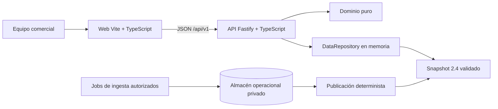
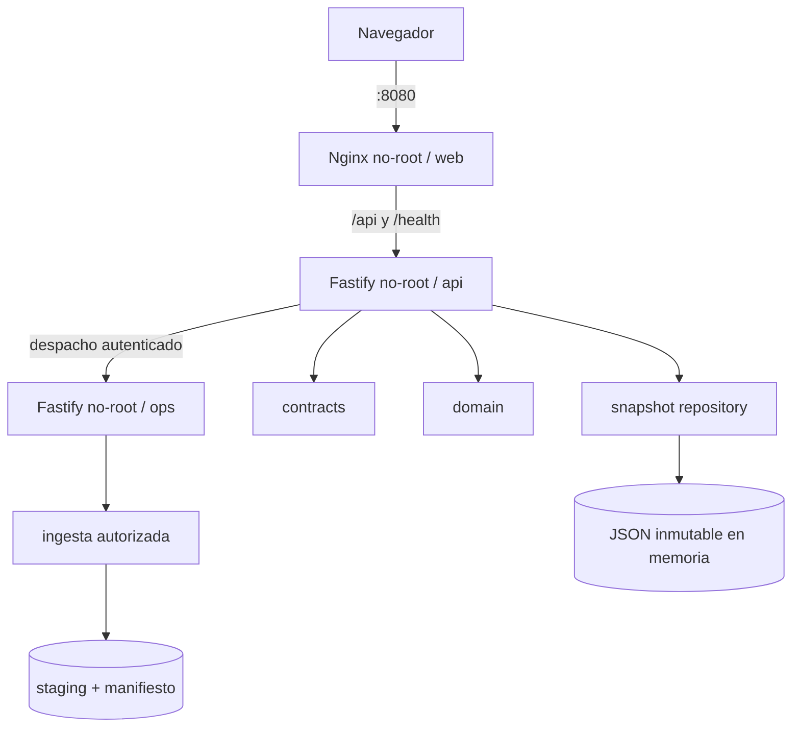

# Arquitectura lean

## Contexto

## Contenedores

## Fronteras

| Componente | Puede conocer | No puede conocer |
|---|---|---|
| `apps/web` | DTO públicos, navegación, presentación | snapshot completo, reglas comerciales, filesystem |
| `apps/api` | HTTP, seguridad, casos de uso | HTML y estado de interfaz |
| `apps/ops` | ejecución batch, staging, manifiestos y policy gates | navegador, publicación automática, datos sin autorización |
| `packages/contracts` | schemas, DTO, versiones | datos o frameworks de UI |
| `packages/domain` | reglas puras y deterministas | DOM, Fastify, archivos, red |
| `packages/snapshot` | validación, índices y consultas | presentación o decisiones HTTP |
| `tools/data` | insumos autorizados y materialización | runtime del usuario |
| `tools/ingestion` | registro, policy gates y jobs batch | frontend y request path del API |

`DataRepository` es el puerto de sustitución. Una futura implementación PostgreSQL no debe cambiar dominio, contratos ni endpoints.

PostgreSQL se incorpora en el plano operacional aprobado por ADR-0004, no como dependencia directa del navegador. El runtime público puede continuar leyendo un snapshot publicado o sustituir el repositorio sin cambiar DTO ni reglas de dominio.

## Flujo de arranque

1. El proceso API lee snapshot y JSON Schema.
2. Valida checksum opcional, contrato, relaciones y privacidad.
3. Construye índices en memoria.
4. `/health/ready` responde 200 únicamente después de completar los pasos anteriores.
5. La web solicita metadata y bootstrap compacto; nunca descarga el snapshot.

Consulta los ADR en `docs/adr/` para conocer las decisiones y sus consecuencias.
