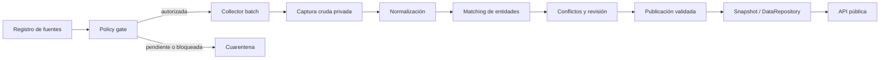

# Actualización continua y contraste multifuente

## Objetivo

Actualizar el catálogo sin introducir scraping en el request path ni perder el origen de un dato. Nexo aporta el universo base mediante un canal autorizado; las webs oficiales aportan observaciones complementarias. Los documentos de Nexo constituyen otra captura de la misma fuente y se contrastan sin asumir que coinciden con la ficha.

## Flujo



## Jerarquía de incorporación

1. Export, API o base Nexo entregada por Viva/CODIP con autorización registrada.
2. Documentos Nexo asociados a cada proyecto o tipología, conservando fecha y huella.
3. Web oficial de la inmobiliaria, habilitada por dominio y rutas.
4. Fuentes transaccionales autorizadas para precios de cierre; no se infieren desde anuncios.

El sitio público de Nexo no se recolecta automáticamente mientras su registro permanezca `blocked`. La matriz histórica de 192 inmobiliarias y 171 dominios es un inventario de descubrimiento, no una autorización de ejecución.

## Referencias oficiales para autorizar y clasificar

- Los [términos de Nexo](https://nexoinmobiliario.pe/terminos-y-condiciones) se registran como restricción contractual del collector público; la vía preferida es un canal concedido por Viva/CODIP.
- El [Código de Protección y Defensa del Consumidor](https://www.leyes.congreso.gob.pe/DetLeyNume_1p.aspx?xNorma=6&xNumero=29571&xTipo=) exige información inmobiliaria clara y mínima, pero no se usa como sustituto de permiso para automatizar una web.
- El [Registro Nacional de Límites — RENLIM](https://www.gob.pe/98535-acceder-al-registro-nacional-de-limites-renlim) es la referencia oficial para límites político-administrativos.
- Los [planos de zonificación del IMP](https://portal.imp.gob.pe/normas-zonificacion-y-sistema-vial-metropolitano/planos-de-zonificacion/) describen usos de suelo. No se reinterpretan automáticamente como zonas comerciales ni como límites distritales.

## Contrato de observación

Cada campo recolectado incluye:

- `sourceId`, URL o identificador de documento y fecha de captura;
- valor original, valor normalizado, unidad y semántica;
- método y localizador (`selector`, `jsonPath`, página o celda);
- hash de la captura, confianza y estado de revisión;
- proyecto/tipología/unidad candidata y score de matching.

Un conflicto se abre cuando observaciones vigentes de la misma entidad/campo no coinciden dentro de su tolerancia. Ambas permanecen disponibles. Una policy determina si el hecho publicado toma una observación, queda vacío o requiere revisión humana.

## Policy gate por fuente web

- dominio oficial confirmado;
- términos y revisión legal/operativa aprobados;
- `robots.txt` compatible con las rutas objetivo;
- referencia auditable de autorización;
- frecuencia, concurrencia, timeout y tamaño máximos configurados;
- sin autenticación, CAPTCHA, evasión, datos personales ni formularios;
- captura solo de información necesaria para el contrato comercial.

`npm run ingestion:plan` lee el registro y la matriz existente sin hacer solicitudes externas. Una salida `COLLECTION_ALLOWED` no reemplaza la revisión humana: demuestra que sus cuatro campos habilitantes quedaron registrados.

## Importación del feed autorizado de Nexo

El repositorio incluye un adaptador offline para un export CSV autorizado. No navega ni descarga el sitio público de Nexo. El adaptador:

- exige exactamente el esquema de `data/source/viva_minimum_dataset_latest.csv`;
- fusiona por `project_id`, actualiza valores informados y conserva el valor vigente cuando la nueva celda está vacía;
- mantiene proyectos anteriores que no estén en una entrega parcial y añade proyectos nuevos;
- elimina `project_contact`, `project_email`, `project_phone` y `project_whatsapp` del artefacto de staging;
- genera un manifiesto con altas, actualizaciones, campos modificados y checksum SHA-256;
- nunca sobrescribe directamente el dataset canónico.

Antes de ejecutarlo, `nexo-authorized-feed` debe figurar como `approved` en `data/source/ingestion/source-registry.json` e incluir una `authorizationReference` auditable. Luego:

```powershell
npm run ingestion:nexo:stage -- --input C:\ruta\export-nexo-autorizado.csv
```

La salida queda en `data/staging/nexo-authorized-merged.csv` junto con su manifiesto. Para publicar la actualización se revisan los conflictos, se reemplaza el CSV canónico mediante un PR y se ejecutan `npm run data:build` y `npm run verify`. Si falta autorización, cambia el esquema, hay IDs duplicados o aparece una fila sin `project_id`, el proceso falla cerrado sin escribir la salida.

## Zonas y cuadrantes

- Distrito: UBIGEO y límite contrastado con RENLIM; una geometría referencial conserva su atribución.
- Zona oficial: exige autoridad, instrumento legal o dataset oficial, versión y geometría.
- Zona comercial interna: exige nombre, owner, versión, criterios y fecha; se muestra expresamente como interna.
- Cuadrantes geométricos arbitrarios no se presentan como oficiales.

## Publicación y rollback

La publicación valida contrato, relaciones, privacidad, checksums y métricas antes de asignar un nuevo `datasetVersion`. Un run fallido queda en cuarentena. El runtime sirve la última versión aprobada y el rollback cambia al artefacto anterior; nunca borra observaciones ni capturas.
